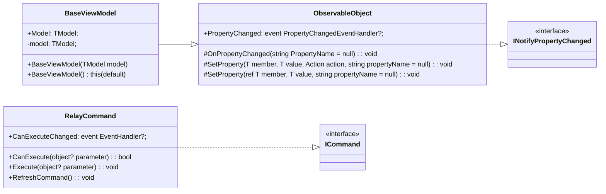
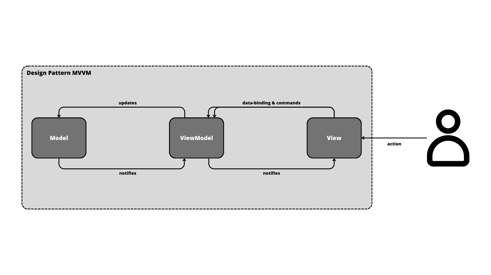
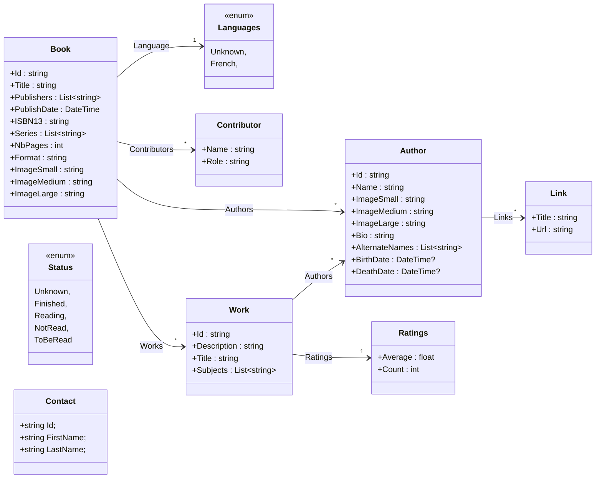
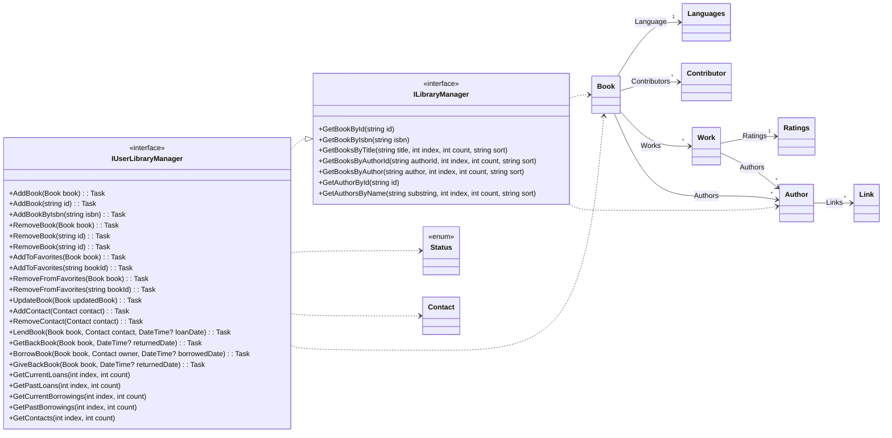

# **LIVRE LAND**

## Bonjour et bienvenue sur le dépôt du projet LIVRE LAND ! 👋

*******

### Sommaire 
 1. [Accessibilité](#acces)
 2. [Progression](#progression)
 3. [Présentation du projet](#presentation)
 4. [Architecture](#architecture)
 5. [Contenu](#contenu)
 6. [Auteurs](#auteurs)

*******

 

Pour accéder au code de l'application, vous pouvez cloner la branche `master` du dépôt Code#0 et ouvrir celle-ci dans `Microsoft Visual Studio` par exemple.    
  
Disponible sur :    

  
  
> **Warning**: L'application est fonctionnelle sous Windows et Android mais n'a pas été testée sous IOS.   

*******

## 🚧  __EN PROGRESSION__

### Étape 1 : Développement des vues en XAML  
- Intégralité des pages proposées sur la page d'accueil développées
- Mode clair & Mode sombre disponibles (pas très esthétique)
- Utilisable en mode portrait ou mode paysage  
- Exploitation des Styles et des Content View réutilisables  
- Mise à disposition de quelques données dans un Stub pour la présentation des vues  
- View Model non utilisés et fonctionnalités pas toutes mises en place (seulement les vues)
- Navigation généralement utilisable mais pas parfaitement codée  

---

### Étape 2 : Personnal MVVM Toolkit

La création de ce `Toolkit Personnel` a pour but de faciliter le développement de l'application en fournissant un ensemble de fonctionnalités et de composants réutilisables. De plus, à l'aide d'une classe comme `RelayCommand`, notre objectif est de ne pas inclure dans nos ViewModels une dépendance avec les Commands de .NET MAUI.  
  
Nous pouvons représenter la structure de notre toolkit avec le diagramme suivant :  

  
Cette strcuture est une version remplaçant pour le moment le `Community Toolkit` mis en place par Microsoft qui permet aussi de supprimer beaucoup de code inutile en remplaçant celui-ci par des annotations et des classes partielles.  

---

### Étape 3 : MVVM  

Nous utilisons au sein de notre projet le **patron d'architecture MVVM** avec les ViewModels Wrapping et Applicatives.  
  
Nous retrouvons donc les 3 grandes parties du patron :  
  
- **Model** :  
Le `Model` représente la `logique métier`. Il est écrit en `C#` et est adpaté pour diifférentes applications.  
  
- **View** :  
Les `Vues` sont écrites en `XAML` et représentent l'interface utilisateur avec les vues de l'application. Le `Data Binding` est utilisé entre les propriétés du XAML et celles des ViewModels. Enfin, des évènements sont déclenchés à partir de certains composants des vues.
  
- **ViewModel** :
Les `ViewModels` sont écrits en `C#` et sont divisables en deux grandes catégories :  
    * Les **Wrapping ViewModel** encapsulent les données du modèle et exposent des propriétés et des commandes nécessaires à la vue pour interagir avec le modèle.   
    * Les **Applicative ViewModel** peuvent inclure une logique métier spécifique et des propriétés calculées, elles peuvent également exposer des commandes pour effectuer des actions spécifiques liées à la vue.  
  
Le schéma suivant montre bien les relations entre les grandes parties du `patron MVVM` :  
  

 
Le **diagramme de classes** pouvant être extrèmement grand à cause des multiples classes au sein de notre projet, j'ai décidé de représenter une partie de celui-ci qui pourrait se répéter pour toutes les autres parties. L'objectif principal étant de comprendre comment fonctionne le **modèle MVVM** et comment les classes intéragissent entre elles, j'ai choisi de faire mon exemple avec la partie des livres qui est la plus générale du sujet.  

*******

## **Présentation**

LivreLand : votre bibliothèque connectée !  
Retrouver tous vos livres préférés en un clic.  

*******

## Fonctionnalités

**TP2 - Base** : 
- [x] Page d'accueil  
- [x] Affichage des livres de l'utilisateur : afficher tous les livres de l'utilisateur dans la vue BooksPage et permettre la sélection d'un livre et la navigation vers la page BookPage  
    * seule la note n'est pas encore affichée sous la forme d'étoiles
- [x] Filtrage par auteur et par date de publication : afficher dans la vue de filtrage (FilterPage)  
  
**TP2 - Ajouts** :  
- [x] Changer le statut de lecture d'un livre
    * la mise à jour du statut de livre se fait si l'on recharge les livres en revenant sur la BooksPage, cependant elle ne se fait pas encore directement sur la page de détails pour le moment
- [x] Ajouter un livre aux favoris  
    * l'ajout en favoris fonctionne, cependant lorque je choisis à partir de la page BooksPage d'ajouter un livre qui ne se trouve pas sur la première page alors celui-ci supprime souvent tous les livres déjà en favoris
- [x] Filtrer les livres par Auteur, Date de publication, Note 
    * le filtrage fonctionne, au deuxième clique sur une date par exemple une fois une première date visitée, je remarque des soucis avec de temps à autre une exception
- [x] Ajouter un livre à sa collection en saisissant l'ISBN
- [x] Supprimer un livre  
- [x] Prêter un livre (et ajouter un contact si besoin)  
    * la page avec les contacts n'est pas esthétiquement très réussie
- [x] Consulter la liste des livres prêtés
    * j'ai fait le choix de n'afficher que les livres _actuellement_ prêtés ou empruntés
  
**TP3** :
- [ ] Modifier l'intégralité du code pour que l'application utilise désormais le MVVM Community Toolkit à la place du toolkit personnel
  
**TP 4** :  
Ajouter les vues et les VM nécessaires pour permettre :  
- [x] Le scan de code-barres afin d'ajouter de nouveaux livres  
    * le scan de code-barres fonctionne mais le livre n'est pas encore directement ajouté dans la liste
- [ ] La recherche en ligne (via le web service)  

*******

## Architectures du modèle et des services fournises

Dans cette partie, vous retrouverez dans un premier temps deux diagrammes mis à disposition dans le sujet représentant d'abord le `Modèle` puis les `Services et Interfaces` :   

### Modèle

---

### Services et Interfaces

*******

## Ressources

- Temps
    - 4 Septembre au 22 Octobre 2023   
- Matériel
    - Ordinateurs portables sous Windows   
    - Émulateur sous Visual Studio 2022
    - Téléphone portable    
- Langages utilisés
    -  
    -  
    -  
- Personnes 
    - 1 étudiant en BUT Informatique

*******

## Auteur

Étudiant 3ème Annnée - BUT Informatique - IUT Clermont Auvergne - 2023-2024   
`BRODA Lou`
